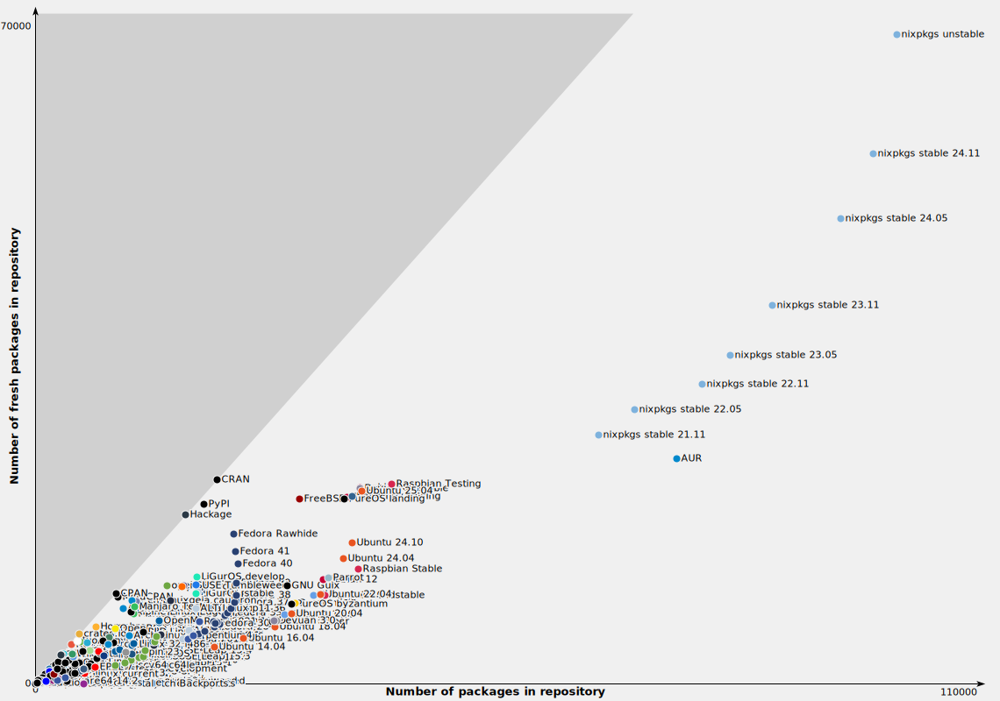

## Table of contents

## History of nix

- 2003: First Nix commit by `Eelco Dolstra`, the inventor
- 2004: First papers on Nix
- 2006: The Nix [PhD thesis](https://edolstra.github.io/pubs/phd-thesis.pdf)
- 2006: `NixOS` by Armijn Hemel
- 2021: Nix0S 21.05
  - 1745 Contributors, 292,223 Commits
- 2022 (December): Nix0S 22.11
  - 4758 Contributors, 428,836 Commits
- 2025 (Now):
  - 5000+ Contributors, 765,994 Commits

## What is nix?

* A 20~MB Program written in C++
* Infrastructure as Code
* Reproducibility

- [Nix](#nix) - functional programming language
- [Nix](#nix-package-manager) - purely functional package manager
- [NixOS](#nixos) - purely functional operating system

## Nix

To start things simple nix is a purely functional lazily evaluated and dynamically typed programming language. Its syntax is quite similar to `json`. It is mainly designed to create `derivations`.

```nix
{
  string = "hello";
  integer = 1;
  float = 3.141;
  bool = true;
  null = null;
  list = [ 1 "two" false ];
  attribute-set = {
    a = "hello";
    b = 2;
    c = 2.718;
    d = false;
  }; # comments are supported
}
```

[Read More...](https://nix.dev/tutorials/nix-language.html)

## Nix Package Manager

`nixpkgs` - a collection of packages, a repo on github, automated to oblivion


[_source_](https://repology.org/repositories/graphs)

Nix is a purely functional package manager that ensures reproducible and reliable builds by using declarative package definitions and isolated environments.
It allows multiple versions of packages to coexist without conflicts and supports atomic upgrades and rollbacks.

### How it works?

Nix stores packages in the Nix store, usually the directory /nix/store, where each package has its own unique subdirectory such as `/nix/store/b6gvzjyb2pg0kjfwrjmg1vfhh54ad73z-firefox-33.1/`
where `b6gvzjyb2pg0kjfwrjmg1vfhh54ad73z` is a unique identifier for the package that captures all its dependencies (it’s a cryptographic hash of the package’s build dependency graph). This enables many powerful features.

### Flakes

Flakes are a new system for managing nix ecosystem. They provide a standard way to write nix expressions whose dependencies are version-pinned in a lock file.

```nix
{
  description = "This is a flake description";
  inputs = {
    nixpkgs.url = "github:nixos/nixpkgs/nixos-unstable";
    nixpkgs-small.url = "github:NixOS/nixpkgs/nixos-unstable-small"; # moves faster, has less packages

    nixpkgs-python.url = "github:NixOS/nixpkgs/6b5019a48f876f3288efc626fa8b70ad0c64eb46"; # moves faster, has less packages
  };

  outputs ={ self, ... }@inputs:
    {
      # Executed by `nix flake check`
      checks."<system>"."<name>" = derivation;
      # Executed by `nix build .#<name>`
      packages."<system>"."<name>" = derivation;
      # Executed by `nix build .`
      packages."<system>".default = derivation;
      # Executed by `nix run .#<name>`
      apps."<system>"."<name>" = {
        type = "app";
        program = "<store-path>";
      };
      # Executed by `nix run . -- <args?>`
      apps."<system>".default = { type = "app"; program = "..."; };

      # Formatter (alejandra, nixfmt or nixpkgs-fmt)
      formatter."<system>" = derivation;
      # Used for nixpkgs packages, also accessible via `nix build .#<name>`
      legacyPackages."<system>"."<name>" = derivation;
      # Overlay, consumed by other flakes
      overlays."<name>" = final: prev: { };
      # Default overlay
      overlays.default = final: prev: { };
      # Nixos module, consumed by other flakes
      nixosModules."<name>" = { config, ... }: { options = {}; config = {}; };
      # Default module
      nixosModules.default = { config, ... }: { options = {}; config = {}; };
      # Used with `nixos-rebuild switch --flake .#<hostname>`
      # nixosConfigurations."<hostname>".config.system.build.toplevel must be a derivation
      nixosConfigurations."<hostname>" = {};
      # Used by `nix develop .#<name>`
      devShells."<system>"."<name>" = derivation;
      # Used by `nix develop`
      devShells."<system>".default = derivation;
      # Hydra build jobs
      hydraJobs."<attr>"."<system>" = derivation;
      # Used by `nix flake init -t <flake>#<name>`
      templates."<name>" = {
        path = "<store-path>";
        description = "template description goes here?";
      };
      # Used by `nix flake init -t <flake>`
      templates.default = { path = "<store-path>"; description = ""; };
    }
}
```

## NixOS

What happens when you nixos-rebuild

* Generations
* Cache
* building from source

Built from the Nix language, package manager and Nixpkgs collection

The result of running Nix Build on Nix code you have written

Completely declarative (like ansible or chef want to be)

## Temporary (ephemeral/transient) environment - nix shell

Nix offers ephemeral shell which allow us to try out new packages or temporarily populate our shell with necessary dependencies.
Let's imagine a scenario where we just installed our new OS and we need to edit some files. We want to use vim.

# TODO: rebuild flag

```shell
vim
# The program 'vim' is not in your PATH
```

For this task we can quickly run

```shell
nix-shell -p vim
```

which will populate our environment with the vim program. Once we exit that shell by typing `exit` the program will be gone from our env.

How did this happen?

This works by `nix` modifying the `PATH` variable and fetching the correct program from `/nix/store`. It also needs to get all `git` dependencies inside path, so the program can run successfully.

A simple comparison is a `pythin venv` but for all packages.

Python example - creating derivations of multiple python instances with different packages available.

Isolation without the need for containers.

```shell
nix-repl> python3.withPackages

nix-repl> python3.withPackages (p: [ p.numpy 1)
derivation /nix/store/ncwwm9zyigl2nm jpdd26mz49m4b97d33-python3-3.18.9-env.drvy

nix-repl> python3.withPackages (p: [ p.jupyter 1)
derivation /nix/store/sc2alBsiSbgrch989y j7hd4cBhir j335-python3-3.18.9-env.drv»
```

`/nix/store/ j199f5Sydqgxiim143r jb6igx1fk3r jdpd-puthon3-3.18.9-env/bin/python`

* user made private packages
* full nix package manager (npm, pip)?
* more about flake outputs
* python version
* when package is not available how to build it from source

## Use flake.nix not Docker

# Dockerfile example
# flake.nix example

Docker is _repeatable_ not _reproducible_.

`Docker` defines instructions but trusts the internet unconditionally, without performing any hashing. Dockerfiles do not provide you with reproducible builds.

- `Nix` guarantees that all inputs for t a build will be the same thanks to the `flake.lock` file.
- The build process will be performed offline, in a sandbox, meaning the output will be the same every time.

There obviously are some exceptions to this.
Some tools are not deterministic to build themselves looking at `java` which puts timestamps to all files which it creates for whatever ungodly reason.

## Simple dev environment

## Cross compiliation

`nix build nixpkgs#pkgsCross.riscv64.hello -L`

`file result/bin/hello`

`uname -a`

## Benefits

- Declarative
- Immutable
- Reproducible
- Unbreakable

- Anyone can compile my code on any machine, the pinnacle of `Works on my machine`.

No need to remember specific commands which you had to manually run to enable a service or install a package; once you set up your environment in nix you are always guaranteed the same result.

Automatically stores backups of all versions of systems which were successfully built after the switch command which can be picked from in the grub boot menu. You will never get locked out of your broken machine, since you can choose previous system configuration on boot.

## Ubuntu vs NixOS

```shell
sudo apt install gcc
sudo apt install service

sudo systemctl start some-service.service
sudo systemctl enable some-service.service

sudo apt uninstall package2
```

vs the declarative way

```nix
{
  services.some-service.enable = true;
  environment.systemPackages = with pkgs; [
    package1
  ]
}
```

## Combination with [direnv](https://direnv.net/) for perfect dev env

[Direnv](https://direnv.net/) is a shell extension that loads and unloads environment variables based on the current directory, enabling per-project isolated environments.
It works by detecting `.envrc` files, executing them in a sub-shell, and exporting the resulting variables to the current shell.

## Installing NixOS remotely

## Installing on machines with terraform

## Disko setup

## Nix cache

## Creating docker containers with nix

[link](https://github.com/nlewo/nix2container)

## Useful links

- [NixOS](https://nixos.org/)
- [Flakes](https://nixos.wiki/wiki/Flakes)
- [Available Packages](https://search.nixos.org/packages)
- [direnv](https://direnv.net/)
- [nix2container](https://github.com/nlewo/nix2container)
- [home-manager](https://github.com/nix-community/home-manager)
- [nixhub](https://www.nixhub.io/packages/)
- [nh](https://github.com/viperML/nh)
- [flake starter](https://github.com/Misterio77/nix-starter-configs)

## Learn more

- [nix.dev](https://nix.dev/)
- [zero-to-nix](https://zero-to-nix.com/)
- [nix-pills](https://nixos.org/guides/nix-pills/)

## Useful commands

- `nix search github:NixOS/nixpkgs/nixos-unstable foo` - find package
